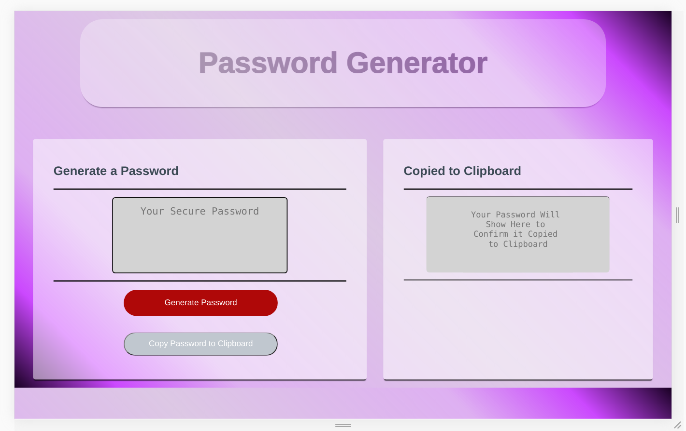
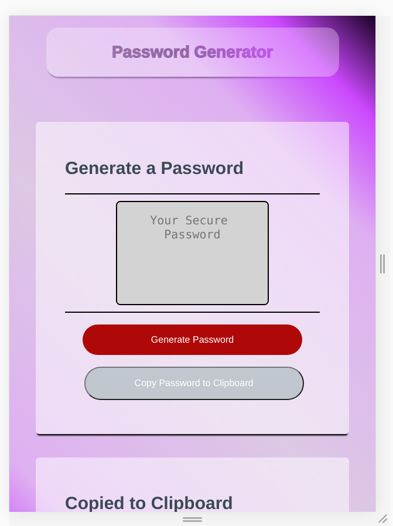

# Password_Generator
This project is an example of using Javascript objects, methods, functions, and logic to create a password generator.

## Usage ##
This application is pretty straight forward
<ol>
<li>Once the page loads, you simply <code> click</code> on the "Generate Password" button.</li>
<li>Then you will be presented with a series of prompts asking you what characters you would like to incorporate into your password</li>
<li>Once the prompts have been completed the generated password will appear in the textarea</li>
<li>At this point the "Copy to Clipboard" button will be enabled, if you would like to copy to the clipboard simply <code>click</code> the "Copy to Clipboard" button.</li>
<ul>
<li>The contents of your clipboard will show on the designated area once copied</li>
</ul>
</ol>

## Screenshots & Links ##
<a href="https://proto133.github.io/Password_Generator" target="_blank" style="font-size:24px;"> Link to Peter Roto's Web Portfolio
</a> 
 
 
### Displayed at 1280px (desktop layout) 

 
 

### Displayed at 500px (mobile layout) 

